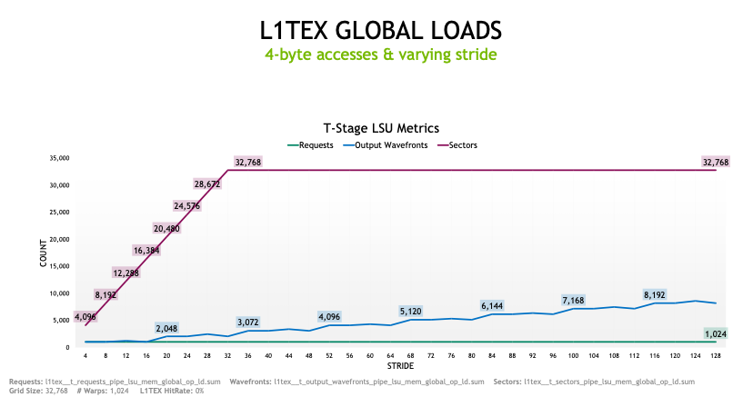
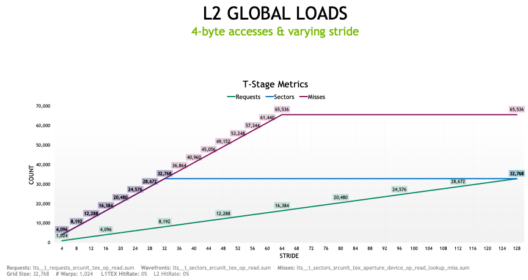

# Data Copy Using LDG/STG Instructions
In this lab, we study a collection of kernels using the LDG (Load from Global) and STG (Store to Global) SASS instruction to move data from/to global memory on the GPU.  

For each exercise, we are going examine three items inside the NCU report:
1. Memory Chart (Memory Workload Analysis section)
2. Memory Tables (Memory Workload Analysis section)
3. Streaming Assembler (SASS) (Source section)

## Some Definitions and Properties
- **Streaming Assembler (SASS)**: This is the native assembly language specific to an NVIDIA GPU's architecture. It's a human-readable representation of the instructions that execute on the GPU. SASS is generated from high-level CUDA code through an intermediate step of Parallel Thread Execution (PTX). While PTX is a more portable, higher-level intermediate representation, SASS is the final, device-specific assembly before it becomes the machine code that runs on the GPU. 

- **Sector**: Aligned 32-byte chunk of memory in a cache line or device memory.  

- **Cache Line**: An L1 or L2 cache line is four sectors (128 bytes). 

- **Memory Cache**: The goal of such memory is to accelerate performance by placing frequently used data in a small amount of extremely fast memory (the cache), which is placed adjacent to the processor. This allows the processor to find often-used data much faster than accessing the same data from disk or even from much faster main memory. There are three types of caches:

1. Write-through cache: 
    - The processor writes data to the cache first and then immediately copies that new cache data to the corresponding memory or disk.
    - The application that's working to produce this data holds execution until the new data writes to storage are completed.
    - Write-through caching ensures data is always consistent between cache and storage.
    <!-- - The L1 cache on the GPU is write-through. -->

2. Write-back cache:
    - The processor writes data to the cache first, and then application execution is allowed to continue before the cached data is copied to main memory or disk.
    - Cache contents are copied to storage later as a background task, such as during idle processor cycles.
    - This allows the processor to continue working on the application sooner (than write-through) and helps to improve application performance.
    - However, this also means there could be brief time periods when application data in cache differs from data in storage, which raises a possibility of application data loss.
    <!-- - The L2 cache is write back. -->

3. Write-around cache:
    - A write-around caching policy doesn't use cache and writes data directly to storage assets such as main memory or even disk.

On NVIDIA's GPUs:
- The L1 cache is write-through. However, the application does not hold execution until the new data writes to storage are completed. 
- The L2 cache is write-back. 

- GPU Memory Subsystem:
A GPU's memory subsystem is a specialized system designed for high-bandwidth, parallel data processing, consisting of several layers of memory with different characteristics, including high-speed local DRAM, shared memory, and various levels of cache. 

### Data Movement Granularity between Memory and Caches
- The minimum granularity is 1 sector or 32 bytes. This means that when a kernel fetches data, the minimum amount of bytes that will be moved between memory caches is 1 sector (32 bytes). 
- The cache line tag, however, applies to 4 sectors (in each case) that comprise the 128-byte cache line. 
- You can adjust L2 cache granularity inside a CUDA program by using the following API call:
```cudaDeviceSetLimit(cudaLimitMaxL2FetchGranularity, l2_granularity); ```, where ```l2_granularity``` is a value between 0 and 128 that indicates the maximum fetch granularity of L2 (in Bytes). This is a hint. On most recent GPUs, the default granularity is set to 64 bytes (2 sectors). 

- **Coalesced memory access**: coalescing means that the memory controler observed the adjacency of addresses and grouped those requests into one transaction, one line or one segment. It's coalescing/grouping the addresses and requesting a minimum amount of lines or segments.    

### **LDG (Load from Global)**: 
- This is the simplest SASS instruction issued by a kernel when accessing data from global memory. The data is moved into a register on the streaming multiprocessor executing the kernel. 
- This call is non-blocking, which means that once a warp within the kernel issues this instruction, the warp may continue executing other instructions (if possible). 
- However, the warp will eventually have to wait for the data to arrive. The data arrival is monitored using a scoreboard. For data being moved from global memory or L2 cache, the scoreboard is referred to as a **long scoreboard**. 
- The average number of clock cycles during which warps were stalled (waiting for data to arrive from global memory) is reported in the ```Warp State Statistics``` section of NCU under ```Stall Long Scoreboard```.  
- **Takeaway**: a high ```Stall Long Scoreboard``` number of cycles in NCU indicates that the kernel is waiting for data to be loaded from global memory while not being able to execute any other instruction during that time. 
 

## I. Copy Kernels with Strided Accesses
- Take a moment to examine to examine the [source code](./src/main_ldg_stride.cu).
- Run [launch_ldg_stride.sh](./launch_ldg_stride.sh) and open generated NCU report, which is available in the [profiles](./profiles/) folder.
- Open the ```Memory Workload Analysis``` section of the report and display ```all``` (dropdown menu in the top right corner of the section).

### Case where ```stride=1```
To gain better insight on how to interpret NCU reports, **we focus on the kernel ```ldg_copy_stride``` with a stride of 1**. 
- Each thread of the warp loads one element of type ```int``` (4-byte access) from the input array, which is stored in global memory. 
- The element is temporarily stored into a register. 
- Then, each thread stores the value from the register back into the output array in global memory. 
- The loads and stores are executed in a coalesced fashion, which means that each thread of a warp loads and stores chunks of data that are contiguous in memory.    

#### Source
The SASS instructions can be examined by opening the ```Source``` tab of the NCU report and selecting "Source and SASS" from the dropdown menu. We can see two specific instructions 
```LDG``` ("load to global") and ```STG``` (store to global) used as follows:

```
...
LDG.E R6, [R2.64]
...
STG.E [R4.64], R6
EXIT
```

- In the first instruction, the thread loads a 32-bit data located at the 64-bit address. This address is stored in registers ```R2``` and ```R3```. The data is then stored into register ```R6```. 
- In the second instruction, the thread stores a 32-bit data from register ```R6``` into global memory at the 64-bit address whose value is stored into ```R4``` and ```R5```. 
- The kernel issues 2 instructions per warp: one load from global memory (LDG), one store to global memory (STG). 
- Note that the SASS only shows the first destination register of the LDG instruction. If we had loaded 16 bytes at once (for example by using the float4 format) with ```LDG.128``` instruction, the data would have been loaded in 4 registers: ```R6```, ```R7```, ```R8```, ```R9```, but only the first register of this sequence wouls be displayed in the SASS:
```
// "load data at global memory addressed stored in R2 and R3 into registers R6, R7, R8, R9.

LDG.128 R6, [R2.64] 
```

#### Memory Tables (Memory Workload Analysis Section)
In this section, we provide some highlights from the GTC 2021 presentation delivered by Magnus Strengert titled "Requests, Wavefronts, Sectors Metrics: Understanding Memory-Bound Kernels with Nsight Compute" ([link to presentation](https://www.nvidia.com/en-us/on-demand/session/gtcspring21-s32089/)) to better interpret the memory workload analysis tables from the NCU report. 

##### Shared Memory
- In the shared memory table, we see no activity since no shared memory was requested/used during the life of the kernel. 

##### L1 Cache 
- **Wavefront**: when a request comes in, it is translated into a wavefront, which is a group of work that you can send down the pipeline at once. If a request cannot be satisfied by only sending one of these packages, you might send the first one down the pipeline, then you send the second wavefront to finish the whole request. A wavefront is the singular maximum unit that you can send down the pipeline and the TAG stage would be the serialization point that would say "I send that many wavefronts down the pipeline until that request is completed." The more wavefronts you need, the more cycles you need to push the work down the pipeline. Consequently, there is a correlation between wavefronts and overall execution time.  

- In the **Global Load** row of the L1/TEX Cache, we see 1 instruction and 1 request. An instruction is counted whenever a warp scheduler executes an instruction. When ```stride = 1```, the warp accesses and loads 32 contiguous elements from global memory, which constitutes a full cache line of 128 bytes. Each cache line is composed of 4 sectors of 32 bytes. When the system allocates memory on the GPU, the allocation is managed in terms of cache lines. The cache line is the minimum amount of allocatable space. However, data movement are done by sectors, which provides a better granularity. In this example, the warp requested 4 sectors, which is what we observe in the **sectors/req** column. In the **Bytes** column, we see 128. Since no data had been transfered before, the 4 sectors were not present in the L1 cache, resulting in misses to L2, and a 0% L1 hit rate.    
- In the **Global store** column, the pattern is similar as for the load.

##### L2 Cache Loads
- In the L2 cache table, we see a similar behavior as for the L1. Since the data is not originally present in the cache, the hit rate for the Load requested from the L1/TEX is 0%. For the store, the hit rate is 100% since the kernel stores the data in L2, and only write to (or "evicts") global memory when the L2 cache is full. Note that the evicition policy can also be tuned from inside a CUDA program. 

- Notice that in the **GPU total** row, the hit rate is 93.89%, and not 0%. The L2 hit rate is computed with additional data that are not explicitly shown in the table on NCU. For instance, the SM is requesting the code itself (e.g., the assembly, the kernel instructions themselves), and that could be a miss and will count as such when computing the hit rate, which is why the hit rate is different than what we would expect. When the SM requests the kernel code itself (program counter, etc.), it will be copied or transferred to the SM directly from L2, and not through L1. Hence, this also explains why we did not observe any discrepancy in the L1 table. 

##### Device Memory
- Loads: We see 88 sectors loaded from global memory (2,816 Bytes). This number includes the data stored in the input array as well as the kernel instructions. 
- Stores: No data was written to device memory.

### Case where ```stride > 1```
#### L1 Cache Behavior
We repeat the same experiment for stride values strictly greater than one when reading the input array. Consider a stride of 8 bytes (i.e., stride = 2). The number of load requests per warp is still 1, but the number of elements loaded will now span 2 different cache lines, or 8 different sectors. The memory accesses for the loads are not coalesced. By observing the L1/TEX table, we can see that the Sectors/Req column indicates a value of 8, which is suboptimal for a 4-byte access pattern. Note that the number of wavefronts has not changed. 

As we increase the stride value, we can see that the number of loaded sectors and the number of sectors per request also increase:
- For a stride 16 bytes (4 ```float``` elements), we move 16 sectors (512 bytes, 16 sectors/req) spanning 4 cache lines, which is executed in one wavefront.
- For a stride of 20 bytes (5 ```float``` elements), we move 20 sectors (640 bytes, 20 sectors/req) spanning 5 cache lines, which is now executed in **two wavefronts**.
- For a stride of 32 bytes (8 ```float``` elements), each thread of the warp loads data from a separate sectors, resulting in 32 different loaded sectors (1024 bytes, 32 sectors/req) executed in two wavefronts. The loaded data spans 8 different cache lines.
- For a stride of 64 bytes (16 ```float``` elements), each thread of the warp loads data from a separate sectors, resulting in 32 different loaded sectors (1024 bytes, 32 sectors/req). The loaded data spans 16 different cache lines, and the load request is now chunked into 4 wavefronts.      
- For larger strides, the number of loaded sectors does not increase because each thread already loads one unique full sector. However, the number of cache lines that are spanned by the access still keeps  on increasing, and so does the number of wavefronts.   



#### L2 Cache Behavior
By observing the L2 Cache table, we can see some differences. 

- For the load requests coming from the L1/TEX cache, the number of requests matches the number of cache lines "touched" by the warp (and not the number of instructions as we saw for L1/TEX): 
    - For a stride of 8 bytes, the L1/TEX cache issued 2 requests. 
    - For a stride of 16 bytes, the L1/TEX cache issued 4 requests.
    - For a stride of 128 bytes, the loaded data touches 32 separate cache lines, and the L1/TEX issued 32 requests.
    - For strides larger or equal than 128 bytes, each thread of the warp loads a 4-byte chunk that touches a separate cache line. Therefore, the number of requests made from L1/TEX to L2 stays constant and equal to 32. 

- For strides larger than 32 bytes (8 elements), the number of sectors requested by the L1/TEX is constant (32 sectors). However, the "sectors misses to device" keep on increasing until the stride reaches a value of 64. This is due to the fact that the L2 cache fetches data from device memory with a granularity of one half of a cache line (2 sectors). So, for a stride of 64 bytes (16 elements), only one element is requested from the first half a cache line, but two sectors will be fetched from device memory, resulting in 2 sectors misses per thread. For strides, larger than 64 bytes, the number of sectors misses to device stays flat. 

- Note that the default granularity at which the L2 fetches data may vary with GPUs. On a H100 80GB, the granularity is 2 sectors compared to one sector on a RTX A6000 Ada Generation (see NCU reports). As we mentioned above, the granularity can be adjusted with the API call: ```cudaDeviceSetLimit(cudaLimitMaxL2FetchGranularity, l2_granularity);```. 



## 2. Copy Kernels with Batches of Elements
In this test, each thread copies a batch of elements from one input array into an output array. So far, we have only used 4-byte accesses. Here, we will see how accessing more data with one instruction can help improve performance. We analyze three kernels that achieve the same output: 

- Examine the [source code](./src/main_ldg_batch.cu).
- Run the following [script](./launch_ldg_batch.sh) to generate a NCU profile with a batch size of 4 elements (16-byte access):

### Importance of unrolling loops when possible
- Compare the CUDA code for the kernels ```ldg_copy_batch_unrolled```, ```ldg_copy_batch``` and describe their main differences.
- In the summary table of the NCU report, what can you observe for the register count between the two kernels? Can you hypothesize why they are different?
- In the source tab of the NCU report, take some time to examine the SASS instructions. 
    - In each kernel, which instructions are being used to load and store data from and to global memory? 
    - Which of the two kernels has the least amount of SASS instructions and why? 
    - Can you comment on the differences: what do the additional SASS instructions do and correspond to?
- Conclude on the effect of unrolling the for loop inside the kernel.
- In the Memory Workload Analysis table of the NCU report, check that the numbers make sense:
    - L1/TEX Cache table: global Load instructions, wavefronts, sectors, sectors/request, hit rate, sector missed to L2.
    - Conduct a similar analysis for the L2 Cache table. 

### Importance of using the ```__restrict__``` keyword
In CUDA programming:
- ```__restrict__``` is a keyword used as a type qualifier for pointers, similar to the restrict keyword in C. 
- It serves as a promise to the compiler that a given pointer is the sole means of accessing the memory it points to within its scope. 
- This means that no other pointer will alias (point to the same memory location as) the ```__restrict__``` qualified pointer.
- The primary purpose of using ```__restrict__``` in CUDA is to enable the compiler to perform **more aggressive optimizations**, particularly related to memory access patterns. 
- When the compiler knows that a pointer is restricted, it can make assumptions about data independence and reorder memory operations, potentially reducing memory latency and improving performance.

Now that we know more about the ```__restrict__``` keyword, let us use it in our code and see if the compiler is able to further optimize the kernel with the unrolled loop. 

- Compare ```ldg_copy_batch_unrolled``` with ```ldg_copy_batch_restrict```: what is the difference? 
- In the source (SASS) section of the NCU report of the ```ldg_copy_batch_unrolled``` kernel, why do you think the LDG an STG instructions are interleaved? 
- In the case of ```ldg_copy_batch_restrict```, was the compiler able to optimize anything? Which of the two kernels is more efficient?

As you saw in this simple test, it is a good coding practice in CUDA to add the keyword ```__restrict__``` in front of arrays (whenever possible) to help the compiler optimize memory operations.  

### Reducing the number of Load / Store instructions
- Compare the CUDA code for the kernels ```ldg_copy_batch_unrolled``` and ```ldg_copy_int4``` and describe their main differences
- In the source tab of the NCU report, examine the SASS instructions and explain the differences 
- In the Memory Workload Analysis table of the NCU report, explain the differences in the L1/TEX Cache table. If wavefronts are a proxy for cycles, which kernel is more efficient? 
- Conclude.

## 3. Finite-Difference Derivative Operator
We are going to study a kernel that performs a derivative operation using a finite-difference approach as an excuse to learn about the importance of cache alignment. More specifically, we will cover the following concepts:
- Lead padding.
- Padding in leading dimension.
- L1/TEX hit rate.

In this test, we show the importance of cache alignment to optimize memory transfer within the GPU. Failing to do so may result in data overfecthing and a misuse of memory bandwidth. 

### Finite-difference derivative in the leading dimension
Examine the kernels in this [source code](./src/main_ldg_deriv_1d.cu) that computes a derivative with a finite-difference approach along the leading (fast) dimension. The "leading dimension" means that two consecutive elements in this dimension are also contiguous in memory. Run the following script to generate NCU profiles ```./launch_ldg_deriv.sh```. 

#### Lead padding
Open the NCU report titled ```ldg_copy_n0_32_n1_1.ncu-rep```, and notice that kernel ```ldg_deriv_copy``` was profiled three times with ```n0=32``` and ```n1=2```. This kernel is a simplified finite-difference operator; it does not perform a derivative operation but simply copies elements from an input array into an output array. 

In the first profile, the input/output arrays are padded by ```RADIUS``` elements in each side for the derivative operation. ```RADIUS``` corresponds to the half length of the finite-difference stencil (set to 1 in this example). Examine the memory tables for the different caches from the memory workload analysis section of the NCU report. 
- In the L1/TEX Cache table, how many sectors and bytes were loaded by the kernel? Was that expected? What caused the excessive number of loaded sectors?
- Comment on the L1/TEX hit rate.
- In the L2 Cache table, how many requests did the load instructions generate from L1/TEX?

In the second profile, the input/output arrays are also padded by ```lead_pad``` elements, such that the first element of the arrays (i.e., the first element that needs to be updated) aligns with the beginning of a cache line. 
- Examine the NCU report for the second kernel profile. Compare with the first profile, and comment on the effect caused by the lead pad.

#### Padding of the leading dimension
Open this the NCU report titled ```./profiles/ldg_copy_n0_32_n1_2.ncu-rep```. We apply the same kernel to an input/output array that now posseses a second dimension of size 2. The derivative is still performed along the leading dimension.  
- Perform a similar analysis as in the previous section. More specifically, explain the number of sectors loaded and stored in the L1/TEX Cache tables for both cases (with and without lead padding). What would be the ideal number of sectors?  
- Can you think of a way (using additional padding) to reduce the number of sectors/bytes loaded? 

One approach is to allocate additional padding in the leading dimension to ensure that the stride between to consecutive elements in the slow direction is a multiple of the cache line size (128 bytes). Examine how this is done in the CUDA program. Select the third kernel inside the [NCU report](./profiles/ldg_copy_n0_32_n1_2.ncu-rep) and comment on the number of sectors moved with this approach. 

#### Try comparing the performance with/without alignement for different array sizes
This simple kernel illustrates how memory alignment can affect performance, especially for bandwidth-bound algorithms. In our example, we used an array of 32 elements which should load/store 4 sectors. We saw that without a proper cache alignment, we moved an additional sector per warp. Let us try different array sizes to better understand how misaligned memory can affect performance. This is also a good exercise to make sure you understand how to read and interpret the L1/TEX and L2 Cache table. We describe a few examples below. Modify the [script](./launch_ldg_deriv.sh) to generate their corresponding NCU reports.

- For ```n0=64``` and ```n1=1``` (2 warps), the kernel executes one LDG instruction per warp (see ```source``` section). 
    - In the misaligned case (without lead padding), for each instruction, the warp requests 32 elements from the L1/TEX cache which are split over two different cache lines. Hence, the number of requested sectors is 10, which is 25% more than the 8 sectors the kernel really needs. In the L2 Cache table, we see 4 requests for the misaligned case. This is due to the fact that each LDG instruction loads data that belong to 2 different cache lines, so 4 cache lines are accessed in total. 
    - In the aligned case (with lead padding), only 8 sectors are moved, which is optimal. Note that in this case, padding the leading dimension has no effect on the performance. 

- For ```n0=1024``` and ```n1=1``` (32 warps), we observe a similar pattern where the kernel moves an extra 25% of data from global memory.   

- For ```n0=32``` and ```n1=2``` (2 warps) , the kernel executes one LDG instruction per warp. 
    - In the case with no lead padding, the kernel requests 10 sectors from the L1/TEX cache. **Explain why there is a hit rate of 1 sector (1 sector is already present in the L1 cache)**. Only three cache lines are touched, which results in 3 requests for the 9 sectors in the L2 cache
    - In the case with a lead padding but without padding the leading dimension, the first warp is aligned with a cache line, so only 4 sectors are requested. However, the second warp is misaligned, resulting in a 5 sectors load. In total, 9 sectors are requested. The LDG instruction executed by the first and second warps will translate into 1 and 2 requests (a total of 3) from the L2 Cache, respectively. 
    - In the aligned case, the ideal number of sectors are being moved 

- For ```n0=32```and ```n1=5``` (5 warps). 
    - In the case with a lead padding but without padding the leading dimension, the first warp is aligned with a cache line, so only 4 sectors are requested. Similarly as for the case where ```n1=1```, the second warp is misaligned by 2 elements, resulting in a 5 sectors load. The third warp is misaligned by 4 elements, and the fourth by 6 elements. However, the fifth warp is now aligned with the next sector. Therefore, the number of sectors loaded in the L1/TEX table is $\rm{n_s = 4 + 3 * 5 + 4 = 23}$, and not 24!   

#### Understanding L1/TEX Cache hit rate
Now that we have obtained an efficient memory alignment for both the input and output, we can compute a finite-difference derivative with respect to the leading direction. We analyze the kernel ```ldg_deriv0``` that computes the first-order derivative for different combinations of ``n0`` and ``n1``:

- For ```n0=32``` and ```n1=1``` (1 warp), we see two LDG instructions.
    - For the misaligned case (no lead pad, no padding of the leading dimension), the first LDG instruction loads 5 sectors. However, the second LDG requests 32 elements with a index shift of -1 (4 bytes), which is aligned with the beginning of a cache line. Consequently, the second LDG instruction will only move 4 sectors. The total number of sectors loaded is 9. Moreoever, the last 4 sectors have already been loaded from the first LDG instruction, and will be located in the L1 cache. The L1 hit rate for the load instructions is thus 4/9. 
    - For the aligned case (lead pad and padding of the leading dimension), the first LDG instructions will load 4 sectors. The second LDG request 32 elements with a index shift of -1 (4 bytes), which will request to move 5 sectors. The total number of sectors loaded is 9 and the L1 hit rate for the load instructions is thus $4/9 = 44.4 \%$. 
    - Notice that our cache alignment strategy did not reduce the number of sectors loaded by the kernel. However, our strategy was beneficial for the store instructions. The kernel does not write in the halo of the output array, so in the case where the output array is padded, all the store instructions are aligned with a cache line, resulting in only 4 stored sectors, 20% less than without padding.
- We invite the user to experiment with different sizes

### Finite-difference derivative in the "slow" dimension
In this example, we propose to implement a kernel that performs a first-order finite-difference derivative in the slow dimension (n1). 
- In the [CUDA source code](./src/main_ldg_deriv_1d.cu), implement the kernel ```ldg_deriv1```. 
- Once completed, profile the kernel with various array sizes and make sure the numbers in the L1/TEX and L2 Cache tables make sense. Take a close look at the L1 hit rate as well. For instance, test ```n0=32``` and ```n1=32```: without looking at the NCU report, can you anticipate what the cache tables will look like? 
- Our proposed solution can be found [here](./src/main_ldg_deriv_1d_solution.cu). 

## Conclusion
In this lab, we learned how a CUDA kernel can load data from GPU global memory and store that data into a register (and vice versa). We focused on two specific instructions, namely ```LDG``` (load from global) and ```STG``` (store to global). We learned how to generate reports on specific kernel using Nvidia's Nsight Compute (NCU) profiling tool, and how to interpret the different components of the Memory Workload Analysis section of these reports. Along the way, we also learned some good coding practices to help the CUDA compiler optimize the code. In the next lab, we learn how to load data from global memory into shared memory, both in a synchronous and asynchronous manner.   

## References and Resources:
- Requests, Wavefronts, Sectors Metrics: [Understanding and Optimizing Memory-Bound Kernels with Nsight Compute](https://www.nvidia.com/en-us/on-demand/session/gtcspring21-s32089/)


