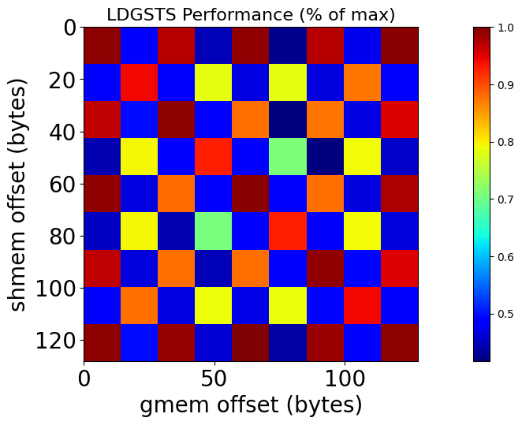
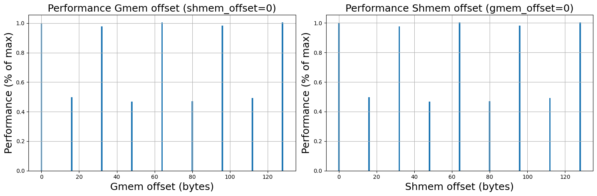

# Data Copy Between Global Memory and  Shared Memory
In this lab, we learn about two ways to load and store data between global and shared memory:
1. **"Synchronously"** by first loading the data into a register (using the ```LDG``` SASS instruction as we saw in the previous lab), and then moving that data from register to shared memory (using the ```STS``` SASS instruction). 
2. **"Asynchronously"** using the ```LDGSTS``` SASS instruction. We will see that under certain conditions, the data can bypass registers as well as the L1 cache and can be directly loaded from global to shared memory. 

The Tensor Memory Accelerator (TMA) feature available on Hopper and Blackwell architectures will be studied in the next lab.

## Resource:
In the following, we revisit some concepts explained in Igor Terentyev's GTC 2024 presentation titled [Advanced Performance Optimization in CUDA](https://www.nvidia.com/en-us/on-demand/session/gtc24-s62192/) and we show how implement them with a collection of samples codes.

<!-- ## Compilation Architecture
- arch_sm=90 -->

## "Synchronous" Copy to Shared Memory (LDG + STS)
We discuss what happens "under the hood" when data is loaded from global memory into shared memory without using LDGSTS:
- The data travels from global memory through the cache hierarchy into a register. 
- This results in a long "scoreboard stall" (a scoreboard is a mechanism that keeps track whether the data has arrived to th register), which means that the second operation (copy to shared memory) cannot start until the first copy is complete.
- Then, the data gets copied from the register into shared memory (+synchronization?). 
- This pathway wastes registers and L1 bandwidth. 
- Similar mechanism when we copy from two different arrays in shared memory, data get copied through the register again, and we observe a short scoreboard stall.

### Copy Kernels
We analyze what happens when we execute the ```copy_shmem``` kernel in [this program](./src/main_ldgsts_copy.cu). First, get familiar with this code and run this [script](./launch_ldgsts_copy_ldg_sts.sh) to generate a NCU profile. ```copy_shmem``` loads data from global memory, stores that data into shared memory (with a strided store), and stores the data back to global memory. We profile multiple times the same kernel with different stride parameters. We analyze cases for different stride values (expressed in number of 4-byte elements) where ```stride=1, 2, 4 and 8```:

- For ```stride=1```, the compiler produced the following SASS:

```
...
LDG.E R2, [R2.64]
...
STS [RZ], R2
BAR.SYNC.DEFER_BLOCKING 0x0
LDS R7, [RZ]
STG.E [R4.64], R7
EXIT
```

The ```LDG``` instruction loads data from global memory into a register. Then the ```STS``` (Store To Shared) instruction stores that data into shared memory. ```BAR.SYNC.DEFER_BLOCKING``` corresponds to the ```__syncthreads();``` call in the kernel: it forces all the threads within a block to wait until all other threads have reached this point in the kernel. In this case, it ensures that all threads within the block are done writing their data into shared memory. The ```LDS``` instructions load the data from shared memory into a register. Finally, ```STG.E``` stores the data back to global memory. 

In the **shared memory table** in the "Memory Workload Analysis" section of the NCU report, we see two instructions issued from the kernel. They correspond to the ```STS``` and ```LDS``` instructions. Each instruction was executed in one wavefront, and we see no bank conflicts. In the rest of the NCU report, we observe a similar pattern as for the copy kernel from the first lab (see L1/TEX and L2 cache tables).  

- For ```stride=2```, the differences appear in the Shared Memory Table. First, we see that both load (LDS) and store (STS) instructions are now executed in 2 wavefronts. Additionally, we see one bank conflict for both loads and stores. With a stride of 2, there is a 2-way bank conflict per warp instruction. This is because elements located at indices ```i``` and ```i+16``` (i < 16) in the input array are stored in the same bank in shared memory. Therefore, the STS instructions are serialized and executed in 2 wavefronts instead of one. 

- For ```stride=4```, we now have a 4-way bank conflict, the loads/stores are executed in 4 wavefronts.
- For ```stride=8```, we now have a 8-way bank conflict, the loads/stores are executed in 8 wavefronts.

<!-- Avoiding bank conflicts can be done by padding the shared memory array or by applying swizzling. We will investigate these two approaches (along with their benefits and drawbacks) further in this lab.  -->

The kernel named ```shmem2shmem_copy``` outputs the same result as ```shmem_copy``` but performs an additional copy to a second shared memory array. Take a look a the SASS in the NCU report and make sure you understand the data path taken when copying between shared memory arrays. 

## "Asynchronous" Copy to Shared Memory (LDGSTS $\neq$ LDG + STS)
### Motivation
"Asynchronous" copies allow us to prefetch data from global memory while performing computation on other data that was previously loaded into shared memory. The corresponding SASS instruction is LDGSTS. Note that the term "asynchronous" may be slight deceiving because the LDG instruction is non-blocking (previous lab). 

The benefits of LDGSTS include the following:
- Increase bytes in flight (better saturation of GPU's memory subystems).
- Bypasses registers (data moves directly to shared memory).
- Reduces L1 traffic, less MIO pressure (fewer instructions).
- Better dependency management. 

- Features:
    - The data travels from global memory and L2 cache directly into shared memory, bypassing the registers. This allows the kernel to use less registers and may lead to better occupancy and/or reduced spillage.
    - **It only works when copying data chunks of size 4, 8 or 16 bytes**. 
    - There are two modes: 
        - **L1 bypass mode**: if the size and the alignment of your copy type is 16 bytes, the data goes directly to shared memory bypassing L1 as well. In other words, it activates when ```sizeof(T)``` and alignment are 16 bytes, where ``T`` is the data type (e.g., ``int4`` or ``float4``). A benefit is that there is no L1 pollution.
        - **L1 access mode**: for the two other allowed sizes (4 and 8 bytes), the data first goes into L1 cache and then into shared memory. 

### How to use it
There are three steps to follow:

1. Call ```__pipeline_memcpy_async``` to fire the asynchronous copy/copies. We can fire several of them, after which we need to attach our synchronization barrier to the previously fired instructions.
2. Call ```__pipeline_commit```.
3. Call ```_pipeline_wait_prior(N)```.

Here are some code snippets:

```
// 'Sync' version (no LDGSTS)
smem[shmem_idx] = gmem[gmem_idx]; 

// 'Async' version (LDGSTS)
__pipeline_memcpy_async(&smem[shmem_idx], &gmem[gmem_idx], sizeof(T));

```
```__pipeline_memcpy_async``` introduces a batch count in barrier for a group of copies fired between two consecutive commits. After we have multiple batches committed, we can wait on the completion of all of them except the last ```N``` with ``__pipeline_wait_prior(N)``:

```
T *gmem;
__shared__ T smem[..];
...
__pipeline_commit(); // First commit

__pipeline_memcpy_async(...); // Issue async load instruction 
...
__pipeline_memcpy_async(...); // Issue async load instruction 

__pipeline_commit(); // Non-blocking batch-counting dependency barrier for previous loads released when data have written to shared memory (for the executing thread)

__pipeline_wait_prior(N); // Blocks the thread until all previous commits except the last N are "ready
```

Another example of using ```__pipeline_wait_prior```:

```
T *gmem;
__shared__ T smem[..];

// Some aysnc loads
...
__pipeline_commit();

// First batch
__pipeline_memcpy_async(...); 
__pipeline_memcpy_async(...); 
__pipeline_commit();

// Second batch
__pipeline_memcpy_async(...); 
__pipeline_memcpy_async(...); 
__pipeline_memcpy_async(...); 
__pipeline_commit();

// Third batch
__pipeline_memcpy_async(...); 
__pipeline_commit();


__pipeline_wait_prior(2); // Only waits for the first batch to finish
```

```__pipeline_wait_prior(0);``` means that I wait for all previously fired async copies. 

Remark on conditional branches with ```__pipeline_memcpy_async```: this call always behaves as a full-warp level instruction regardless of warp divergence. The code below is equivalent to 2 commits in case of divergence:

```
if (cond)
    __pipeline_commit();
else
    __pipeline_commit();
```
This means that if there are two threads that diverge, they will both call ```__pipeline_commit()``` from two branches, and this will count as two separate batches. If we commit in a divergent code, the number of commits equals to the number of divergent branches which can be runtime depend. Example:

```
__pipeline_commit(); // Unconditional commit

if (condition)  
    __pipeline_commit();
else
    __pipeline_commit();

__pipeline_wait_prior(1); // If cond == true, this call is going to make the thread wait for the first two pipeline_commit(). We're going to be overwaiting. 
```
**Recommendation**: Do not call ``pipeline_commit()`` in divergent code (i.e., in ``if`` branches).

## Exercises
### 1. Copy kernels using LDGSTS
Let's revisit this [code](./src/main_ldgsts_copy.cu) and now examine kernels ``copy_ldgsts`` and ```copy_ldgsts_bypass_l1``` that make use of the LDGSTS instructions. Launch this [script](./launch_ldgsts_copy_ldgsts.sh) to generate the NCU profile titled```ldgsts_copy_shmem_stride.ncu-rep```, located in the profiles folder. For each kernel, we purposely launch only one warp to simplifiy the analysis of the NCU report. Take some time to read the reports for the 4 kernels that were profiled. Examine the source (SASS) and the memory movements. There is no difficulty here, but make sure you understand what happens in each case. 

### 2. Finite-Difference Derivative Operator
We move to slightly more complicated kernels. We simulate a finite-difference operator that computes a spatial derivative across three different domains (left, center, right). We typically encounter such type of scenarios in numerical simulations (e.g., seismic wavefield modeling) when stitching domains with different physics together or when using a Perfecly Matched Layer (PML) boundary condition. 

#### Derivative Operator applied to a 1D array
The code is located [here](./src/main_ldgsts_deriv_1d.cu). We consider three input 1D arrays which correspond to three different modeling domains: left, center and right. In this program, there are five kernels that compute a finite-difference derivative at every point of the center array, which require some values outside of this array located in the halos (left and right). The output of these five kernels should be identical. 

The first three kernels make use of LDG and not LDGSTS. We want to illustrate how branching (``if`` statements) inside a kernel could affect the SASS produced by the compiler, and therefore the performance of the code. Run the following [script](./launch_ldgsts_deriv_1d.sh) to generate a NCU report named ```ldgsts_deriv_1d.ncu-rep```. Focus on the first three kernels profiled in the report: ```deriv1d_ldg```, ```deriv1d_ldg_sts```, and ```deriv1d_ldg_no_branch```:
- Look at the source code and identify the main differences between the three kernels.  
- Now, closely examine the SASS produced by the compiler. Which kernel is the most efficient one? Why?

The last two kernels perform the same operations using LDGSTS. In a similar fashion as for the first three kernels, the difference is the way the conditional branching is handled when computing the derivative on the edge of the center array. No difficulty here, just make sure you understand the SASS instructions. 

Finally, notice the use of the ```__align__(16)``` keyword in front of the shared memory declaration inside the kernel. This keyword ensures that the shared memory array is 16-byte aligned. In the next section, we will see that in certain cases, failing to do so may affect the performance of LDGSTS copies. 

#### Derivative Operator applied to a 3D array
The code for this example is located [here](./src/main_ldgsts_deriv_3d.cu). Generate a NCU profile by executing this [script](./launch_ldgsts_deriv_3d.sh). We consider an array representing a 3D volume on which we apply a finite-difference derivative operator along the second fastest dimension (```dim1``` in the code). This code replicates the example proposed in Igor Terentyev's GTC 2024 [presentation](https://www.nvidia.com/en-us/on-demand/session/gtc24-s62192/) (slide 54). Just like the previous example, we use three domains (left, center and right) to compute the derivative values at every grid points in the center array.  

We implement two types of kernels that generate the same results:  
- using LDG instructions to store the input arrays into shared memory: ```deriv_ldg``` and ```deriv_ldg_no_branch```, and 
- using LDGSTS: ```deriv_ldgsts```, ```deriv_ldgsts_no_branch```, ```deriv_ldgsts_float4```, and ```deriv_ldgsts_overlap```. 

The two kernels using LDG illustrate how branching (when loading the left and right borders) can be effectively achieved. ```deriv_ldgsts_float4``` shows how 16-byte access can improve performance, and ```deriv_ldgsts_overlap``` allows you to overlap compute/loading to shared memory to maximize the number of bytes in flight.

<!-- - Selected
- Predicated
- Branching -->

### Importance of Memory Alignment for LDGSTS Performance
LDGSTS requires alignment of shared memory address as well as global memory address both by 128 Bytes. In other words, we need to make sure that the first element we are copying from global memory (the source) is aligned with the beginning of a cache line. This requirement is also valid for the shared memory array (the destination). Failing to do so can result into more load requests (wavefront) and lead to a performance decrease. 




<!-- 
### Matrix Transpose
## Things2Do
- **Copy simple arrays with different offsets** (float4, etc. and check when it does not work) 
- **Be careful with the words ``synchronous`` and ``asynchronous``**: explain waht we mean by that. LDG can be asynchrnous. What we mean by asynchronous is that we can overlap compute and data loading for the next iteration.  
- Check between LDG and LDGSTS if MIO warp state statistics changes between the two.
- Write LDGSTS tests with memory alignment 4, 8, 16 (identify the different modes).
- Add the code to generate the matrix.
- Alignment tests
- Check LDGSTS bytes
- Example of when you allocate a structure which creates a misalignment in shared memory

## Topics soon to be added
- Show how to declared shared memory
    - Statically
    - Dynamically with size > 48 kB
    - Dynamically unknown at compile time
- Simple copy from global to shared memory
    - Look at path: LDG + STS
    - Example of bank conflicts
    - Observe SASS when we have __syncthreads();
    - Example of how to load from shared memory into registers + observe the corresponging SASS instructions
- Async copy from global to shared memory
    - Make sure to understand that LDGSTS $\neq$ LDG + STS
    - Look at path: LDGSTS (bypass registers)
    - Example of bank conflicts (re-visit matrix transpose)
    - Observe SASS when we have __syncthreads() + pipeline commit;
    - Load with 16-byte chunks
    - Example of how to load from shared memory into registers + observe the corresponging SASS instructions (probably the same as for the synchronous approach)
- Look at alignement effect (source and destination). Create an example where we allocate some structure in shared memory which creates a non-alignment (to show that you need the ```align``` keyword). 
-->

## References and Resources:
- [Advanced Performance Optimization in CUDA](https://www.nvidia.com/en-us/on-demand/session/gtc24-s62192/) (Terentyev, 2024)

<!-- - Predicated instruction: lighweight but all threads pass on instruction, but only threads with predicated on that executre instruction (the other one my even have invalid arguments and are masked offf)
- Branch: more "heavy" than predicated, only the threads entering the branch execute the instructions
- Block de 16 x 16 instead of 32 x 8 for bank conflicts
- /usr/local/NVIDIA-Nsight-Compute-INTERNAL-2025.4  -->